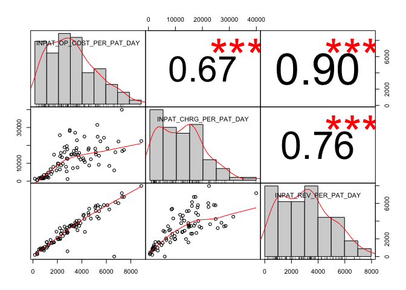
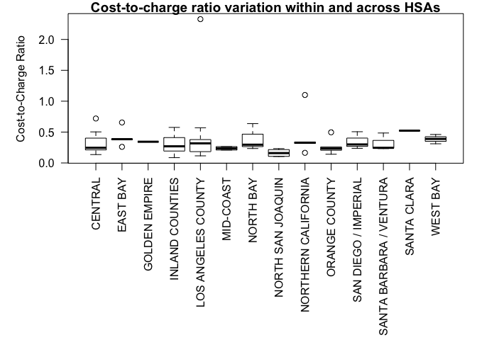
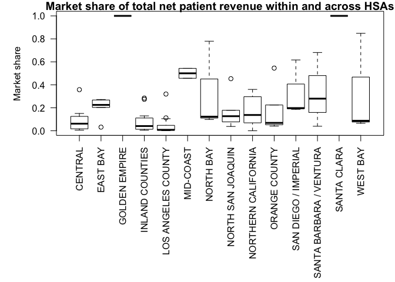
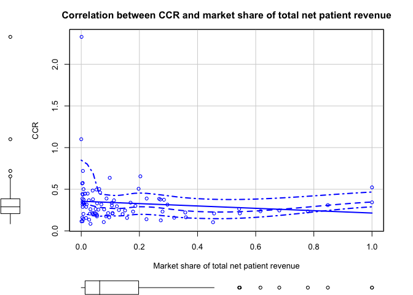

California OSPHD Financial Data - Point in time Market CCRs
================
February 15, 2019

Load Packages
=============

``` r
library(knitr)
library(sqldf)
```

    ## Loading required package: gsubfn

    ## Loading required package: proto

    ## Loading required package: RSQLite

``` r
library(Hmisc)
```

    ## Loading required package: lattice

    ## Loading required package: survival

    ## Loading required package: Formula

    ## Loading required package: ggplot2

    ## 
    ## Attaching package: 'Hmisc'

    ## The following objects are masked from 'package:base':
    ## 
    ##     format.pval, units

``` r
library(PerformanceAnalytics)
```

    ## Loading required package: xts

    ## Loading required package: zoo

    ## 
    ## Attaching package: 'zoo'

    ## The following objects are masked from 'package:base':
    ## 
    ##     as.Date, as.Date.numeric

    ## 
    ## Attaching package: 'PerformanceAnalytics'

    ## The following object is masked from 'package:graphics':
    ## 
    ##     legend

``` r
library(car)
```

    ## Loading required package: carData

``` r
library(httr)
library(jsonlite)
```

Load OSHPD Data* * requires internet connection, pulls from CHHS API
====================================================================

``` r
# Link to OSHPD 2016 Financial and Ops Data
url_OSHPD2016 <- 'https://data.chhs.ca.gov/api/3/action/datastore_search?resource_id=519aa719-210c-48f9-ba17-7cc5715596a0'

# Create R Dataframe from download
OSHPD_2016_response <- content(GET(url_OSHPD2016), "text")
OSHPD_2016_JSON <- fromJSON(OSHPD_2016_response, simplifyDataFrame = TRUE, flatten = TRUE)
OSHPD_2016 <- as.data.frame(OSHPD_2016_JSON$result$records) # pull records

OSHPD_2016_labels <- as.data.frame(OSHPD_2016_JSON$result$fields) # pull data order
OSHPD_2016_labelorder <- as.vector(OSHPD_2016_labels$id)
OSHPD_2016 <- OSHPD_2016[c(OSHPD_2016_labelorder)]

# Recast variables as needed
OSHPD_2016[,18:133] <- sapply(OSHPD_2016[,18:133],as.character)
OSHPD_2016[] <- lapply(OSHPD_2016, gsub, pattern=',', replacement='')
OSHPD_2016[,18:133] <- sapply(OSHPD_2016[,18:133],as.numeric)
```

    ## Warning in lapply(X = X, FUN = FUN, ...): NAs introduced by coercion

    ## Warning in lapply(X = X, FUN = FUN, ...): NAs introduced by coercion

    ## Warning in lapply(X = X, FUN = FUN, ...): NAs introduced by coercion

    ## Warning in lapply(X = X, FUN = FUN, ...): NAs introduced by coercion

    ## Warning in lapply(X = X, FUN = FUN, ...): NAs introduced by coercion

    ## Warning in lapply(X = X, FUN = FUN, ...): NAs introduced by coercion

    ## Warning in lapply(X = X, FUN = FUN, ...): NAs introduced by coercion

    ## Warning in lapply(X = X, FUN = FUN, ...): NAs introduced by coercion

    ## Warning in lapply(X = X, FUN = FUN, ...): NAs introduced by coercion

    ## Warning in lapply(X = X, FUN = FUN, ...): NAs introduced by coercion

    ## Warning in lapply(X = X, FUN = FUN, ...): NAs introduced by coercion

    ## Warning in lapply(X = X, FUN = FUN, ...): NAs introduced by coercion

    ## Warning in lapply(X = X, FUN = FUN, ...): NAs introduced by coercion

    ## Warning in lapply(X = X, FUN = FUN, ...): NAs introduced by coercion

    ## Warning in lapply(X = X, FUN = FUN, ...): NAs introduced by coercion

    ## Warning in lapply(X = X, FUN = FUN, ...): NAs introduced by coercion

    ## Warning in lapply(X = X, FUN = FUN, ...): NAs introduced by coercion

    ## Warning in lapply(X = X, FUN = FUN, ...): NAs introduced by coercion

``` r
# Create readable names for HSAs
OSHPD_2016$HSA <- as.character(OSHPD_2016$HSA)
OSHPD_2016$HSA[OSHPD_2016$HSA=="01"] <- "NORTHERN CALIFORNIA"
OSHPD_2016$HSA[OSHPD_2016$HSA=="02"] <- "GOLDEN EMPIRE"
OSHPD_2016$HSA[OSHPD_2016$HSA=="03"] <- "NORTH BAY"
OSHPD_2016$HSA[OSHPD_2016$HSA=="04"] <- "WEST BAY"
OSHPD_2016$HSA[OSHPD_2016$HSA=="05"] <- "EAST BAY"
OSHPD_2016$HSA[OSHPD_2016$HSA=="06"] <- "NORTH SAN JOAQUIN"
OSHPD_2016$HSA[OSHPD_2016$HSA=="07"] <- "SANTA CLARA"
OSHPD_2016$HSA[OSHPD_2016$HSA=="08"] <- "MID-COAST"
OSHPD_2016$HSA[OSHPD_2016$HSA=="09"] <- "CENTRAL"
OSHPD_2016$HSA[OSHPD_2016$HSA=="10"] <- "SANTA BARBARA / VENTURA"
OSHPD_2016$HSA[OSHPD_2016$HSA=="11"] <- "LOS ANGELES COUNTY"
OSHPD_2016$HSA[OSHPD_2016$HSA=="12"] <- "INLAND COUNTIES"
OSHPD_2016$HSA[OSHPD_2016$HSA=="13"] <- "ORANGE COUNTY"
OSHPD_2016$HSA[OSHPD_2016$HSA=="14"] <- "SAN DIEGO / IMPERIAL"
OSHPD_2016$HSA <- as.factor(OSHPD_2016$HSA)
```

Reduce observations to comparable / hospitals of interest
=========================================================

For now limit the analysis to 'comparable' hospitals, which the OSHPD codebook recommends for hospital-to-hospital operational and data comparisons.

``` r
OSHPD_2016_comparable <- subset(OSHPD_2016, TYPE_HOSP == 'Comparable')
```

Calculate Cost/Efficiency Metrics
=================================

### 1) Operational cost per patient day

For this metric, it might make most sense to only estimate inpatient operating expenses over patient days (days of inpatient stay) as a measure of inpatient efficiency (ignoring outpatient costs and revenues). Note that an inpatient stay starts at admission and ends the day before discharge. If admit and discharge are the same day, patient days = 1.

### 2) Charges per patient day

For this metric, it might again make sense to only estimate inpatient revenues over patient days, ignoring outpatient revenues. Per OSHPD documentation, gross revenue are total charges at the hospital's full established rates.

### 3) Revenues per patient day

For this metric, it might again make sense to only estimate inpatient revenues over patient days, ignoring outpatient revenues. Per OSHPD documentation, net revenue are revenues that were actually received from patients.

### 4) Cost-to-Charge Ratio

For now, will calculate cost-to-charge ratio as described in the OSHPD data manual, which includes the removal of non-patient care revenue. Cost-to-revenue metric could be considered in the future.

``` r
# 1) Inpatient operational cost per patient day 
OSHPD_2016_comparable$INPAT_OP_COST <- 
  (OSHPD_2016_comparable$GRIP_TOT / (OSHPD_2016_comparable$GRIP_TOT + OSHPD_2016_comparable$GROP_TOT)) * OSHPD_2016_comparable$TOT_OP_EXP

OSHPD_2016_comparable$INPAT_OP_COST_PER_PAT_DAY <- OSHPD_2016_comparable$INPAT_OP_COST / OSHPD_2016_comparable$DAY_TOT

# 2) Inpatient charges per patient day
OSHPD_2016_comparable$INPAT_CHRG_PER_PAT_DAY <- 
  (OSHPD_2016_comparable$GRIP_TOT / OSHPD_2016_comparable$DAY_TOT)

# 3) Inpatient revenues per patient day
OSHPD_2016_comparable$INPAT_REV <- 
  (OSHPD_2016_comparable$GRIP_TOT / (OSHPD_2016_comparable$GRIP_TOT + OSHPD_2016_comparable$GROP_TOT)) * OSHPD_2016_comparable$NET_TOT

OSHPD_2016_comparable$INPAT_REV_PER_PAT_DAY <- OSHPD_2016_comparable$INPAT_REV / OSHPD_2016_comparable$DAY_TOT

# 4) Cost-to-charge ratio
OSHPD_2016_comparable$CCR <- 
  (OSHPD_2016_comparable$TOT_OP_EXP - OSHPD_2016_comparable$OTH_OP_REV) / (OSHPD_2016_comparable$GRIP_TOT + OSHPD_2016_comparable$GROP_TOT)
```

Run Correlations
================

``` r
corr_vars <- sqldf("SELECT INPAT_OP_COST_PER_PAT_DAY, INPAT_CHRG_PER_PAT_DAY, INPAT_REV_PER_PAT_DAY
                    FROM OSHPD_2016_comparable
                    ")

corr_check <- rcorr(as.matrix(corr_vars))

# Run Pearson test, and look at distribution
chart.Correlation(corr_vars, method = "pearson", histogram=TRUE, pch=20, main="Inpatient cost, charge, and revenue per patient day of CA hospitals")
```



Additional Analyses
===================

Other things that could be interesting specific to just this data: 1) Variation of CCRs within and across markets. 2) Relationship between cost metrics and market share (within HSA)

Because this is an exploratory analysis, I will not focus on the following for now for the sake of brevity: 3) Relationship between cost metrics and hospital charecteristics (type \[incl. teach and rural\], bed size, etc) 4) Relationship between cost metrics and payer mix

``` r
#1) Look at CCR variation across HSAs
par(mar=c(13,5,1,1))
boxplot(CCR~HSA, data = OSHPD_2016_comparable, 
        ylab = "Cost-to-Charge Ratio",
        las = 2,
        main = "Cost-to-charge ratio variation within and across HSAs")
```



``` r
#2) Calculate a metric of market share, for now will focus on total net patient revenue, though commercial could be considered.
HSA_NET_TOT_SUM <- sqldf("SELECT HSA, SUM(NET_TOT) AS NET_TOT_SUMHSA
                          FROM OSHPD_2016_comparable
                          GROUP BY HSA
                         ")

OSHPD_2016_share <- sqldf("SELECT OSHPD_2016_comparable.*, HSA_NET_TOT_SUM.NET_TOT_SUMHSA
                               FROM OSHPD_2016_comparable 
                               LEFT JOIN HSA_NET_TOT_SUM ON OSHPD_2016_comparable.HSA=HSA_NET_TOT_SUM.HSA")

OSHPD_2016_share$share_net_tot <- OSHPD_2016_share$NET_TOT / OSHPD_2016_share$NET_TOT_SUMHSA

boxplot(share_net_tot~HSA, data = OSHPD_2016_share, 
        ylab = "Market share",
        las = 2,
        main = "Market share of total net patient revenue within and across HSAs")
```



``` r
corr_vars2 <- sqldf("SELECT share_net_tot, CCR
                    FROM OSHPD_2016_share
                    ")

corr_check <- rcorr(as.matrix(corr_vars2))
corr_check
```

    ##               share_net_tot   CCR
    ## share_net_tot          1.00 -0.12
    ## CCR                   -0.12  1.00
    ## 
    ## n
    ##               share_net_tot CCR
    ## share_net_tot            90  89
    ## CCR                      89  89
    ## 
    ## P
    ##               share_net_tot CCR   
    ## share_net_tot               0.2695
    ## CCR           0.2695

``` r
par(mar=c(5,5,3,3))
scatterplot(CCR ~ share_net_tot, data=OSHPD_2016_share, 
  xlab="Market share of total net patient revenue", ylab="CCR", 
  main="Correlation between CCR and market share of total net patient revenue")
```


